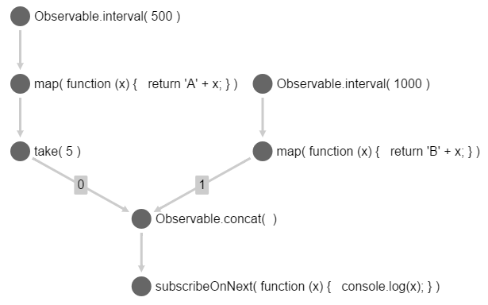

# rx-graphlib-network
TODO: rename frp-graphlib-network

`rx-graphlib-network` converts a [Graphlib](https://github.com/cpettitt/graphlib) graph into a network of [RxJS](https://github.com/Reactive-Extensions/RxJS) observables.

## Why is this useful?

- Easy serialization and deserialization of Rx networks to / from JSON
- Visualization of Rx networks (dependency graphs) using graph libraries like [Cytoscape.js](http://js.cytoscape.org/) (see image below)
- Live-visualization of dataflows
- Creation of Rx networks and pipelines using a visual graph editor

## Example



Above, you see a simple network (dependency graph) of Rx observables that we want to re-create in this example. Here is a representation of this network as a Graphlib graph:

```js
import graphlib from 'graphlib';

const graph = new graphlib.Graph();
graph.setNode( 'A', ['Observable.interval', 500] );
graph.setNode( 'B', ['Observable.interval', 1000] );
graph.setNode( 'A_map', ['map', x => 'A' + x] );
graph.setNode( 'A_take5', ['take', 5] );
graph.setNode( 'B_map', ['map', x => 'B' + x] );
graph.setNode( 'AB_concat', ['Observable.concat'] );
graph.setNode( 'subscribe', ['subscribeOnNext', function(x) { console.log(x) } ] );

graph.setEdge( 'A', 'A_map' );
graph.setEdge( 'A_map', 'A_take5' );
graph.setEdge( 'B', 'B_map' );

// setting index
graph.setEdge( 'A_take5', 'AB_concat', 0 );
graph.setEdge( 'B_map', 'AB_concat', 1 );
graph.setEdge( 'AB_concat', 'subscribe' );
```

`rx-graphlib-network` tries to be as flexible as possible. Thus you can attach whatever data you want to the graph nodes (in this case an array with an operator name as the first argument, followed by additional arguments that will be passed to the operator). It is not necessary to attach data to edges, you can however set an index that will be used for sorting the incoming sources, in case that is necessary (f.ex. for `Rx.Observable.concat`).

Due to this flexibility, `rx-graphlib-network` doesn't know how to insert these operators into the network, thus we need to provide an `insertOperator` function to take care of this. This function will be called for every node. It receives the node's data and an array of source observables (sorted by the edge indexes) and must return a new observable. The graph's nodes have been [topologically sorted](https://en.wikipedia.org/wiki/Topological_sorting) first to assure that all source observables exist before trying to create an operator.

```js
import rxGraphlibNetwork from 'rx-graphlib-network';
import Rx from 'rx';

// super simple Rx inserter
function insertOperator( operatorConfig, sources ) {
  let operatorName = operatorConfig[0];
  const args = operatorConfig.splice( 1 );

  // static operators
  if( operatorName.startsWith( 'Observable.' ) ) {
    operatorName = operatorName.substr( 11 );
    // passing the sources (for 'merge', 'concat', etc.)
    return Rx.Observable[ operatorName ]( ...sources, ...args );

  // instance operators
  } else {
    const source = sources[0];
    return source[ operatorName ]( ...args );
  }

}

// running the graph; we'll get back a dictionary of the created
// observables
const observables = rxGraphlibNetwork.run( graph, insertOperator );
```

Inserters can be far more complex than this, possibly providing shared state, custom operators, etc. That's up to the developer.

## API

<a name="run" href="#run">#</a> **run**( graph, insertOperator )

Takes a Graphlib graph and connects it to an observable network. The seond argument, `insertOperator`, is responsible creating the operator. It receives the user-set operator configuration and an array of source observables.

`run` is equivilant to the following code:
```js
const topsortedNodes = rxGraphlibNetwork.getTopsortedNodes( graph );
const observables = rxGraphlibNetwork.connectOperators( topsortedNodes, insertOperator );
```
The operation can thus be split into two steps (useful if the same graph should be run multiple times).

<a name="getTopsortedNodes" href="#getTopsortedNodes">#</a> **getTopsortedNodes**( graph )

Takes a Graphlib graph and returns an array of topsorted graph nodes in the following format:

```js
{
  id,              // id of graph node (string)
  operatorConfig,  // user-set node data (*)
  sources          // ID's of sources (string[])
}
```

<a name="connectOperators" href="#connectOperators">#</a> **connectOperators**( topsortedNodes, insertOperator )

Takes an array of topsorted nodes and connects those nodes by calling the provided `insertOperator` function.
